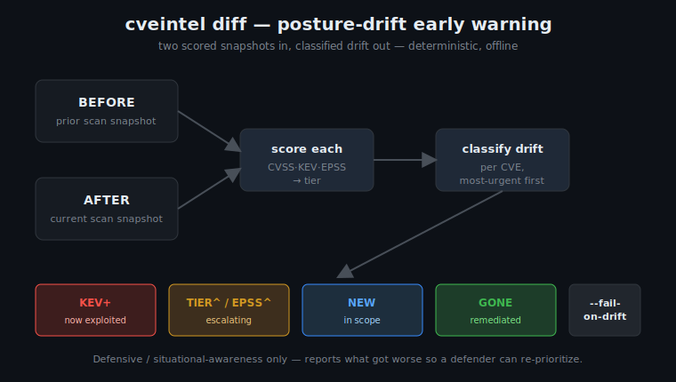

# Posture drift & early warning — `cveintel diff`

> Defensive / situational-awareness tooling. `cveintel diff` reports **what got
> worse** between two vulnerability snapshots so a defender can re-prioritize
> remediation. It contains no exploitation, targeting, or offensive logic.



*Diagram: generated SVG, original to this repository (CC-BY-4.0, Cognis Digital).*

## The problem this solves

A single ranked snapshot answers "what is my exposure *right now*?" That's
useful on day one and nearly useless on day two, because the human reading it
has already triaged it. The question that actually drives remediation work on an
ongoing basis is different:

> **What changed since the last look, and which of those changes newly demands
> an emergency change ticket *today*?**

That question is hard to answer by eyeballing two ranked lists. A nightly
external-attack-surface scan of an enterprise edge can carry hundreds to
thousands of CVEs. The dangerous ones on any given day are almost never the
top-of-list CRITICALs you already actioned — they are the items that **drifted**:
a quiet medium-severity bug that just got added to CISA KEV, or whose EPSS
exploitation-probability spiked overnight because a public PoC dropped and mass
scanning began.

The lifecycle of an internet-facing vulnerability, in the order a defender can
*observe* it, is roughly:

```
disclosed (CVSS assigned)  →  EPSS rises (PoC / chatter / scanning)
                           →  added to CISA KEV (confirmed in-the-wild)
                           →  mass exploitation
```

EPSS movement is frequently the **earliest machine-readable signal** a defender
gets, often days ahead of a KEV listing. `cveintel diff` is built to catch the
posture moving through those stages and to page you on the transition rather
than the steady state.

## What it detects

`diff` scores both snapshots with the same transparent CVSS·KEV·EPSS model the
rest of the tool uses, then classifies every per-CVE change. Each CVE can carry
several change kinds at once (they stack):

| Kind     | Meaning                                                    | Worsens posture? |
|----------|------------------------------------------------------------|:---:|
| `kev_added`   | newly listed on CISA KEV — proven in-the-wild exploitation | yes |
| `tier_up`     | crossed a triage-tier boundary upward (e.g. MED → CRITICAL)| yes |
| `epss_spike`  | EPSS rose ≥ 0.10 (10 pts) — rising exploitation likelihood | yes |
| `cvss_up`     | NVD revised the base score up ≥ 1.0 on reanalysis          | yes |
| `appeared`    | newly in scope (new asset / new finding)                   | yes |
| `cvss_down`   | NVD revised the base score down ≥ 1.0                      | no  |
| `epss_drop`   | EPSS fell ≥ 0.10                                            | no  |
| `tier_down`   | de-escalated a tier                                        | no  |
| `kev_removed` | removed from CISA KEV (catalog correction)                 | no  |
| `resolved`    | dropped out of scope (remediated / decommissioned)         | no  |

The thresholds (`EPSS_SPIKE_DELTA = 0.10`, `CVSS_REVISION_DELTA = 1.0`) are
constants in `cveintel/drift.py`, chosen so routine NVD reanalysis jitter
(±0.1–0.2 CVSS) doesn't generate noise while genuine movement does.

Output is **sorted most-urgent first** — by the most urgent drift kind on the
item, then by the item's current composite score descending, then by CVE id for
a stable, deterministic order. Unchanged CVEs are omitted entirely; you only see
the delta.

## Worked example

The bundled demo `demos/12-posture-drift-early-warning/` models a real
edge-appliance fleet across one night, using documented 2023–2024 CVEs
(Citrix Bleed, Ivanti Connect Secure, PAN-OS GlobalProtect, MOVEit, ConnectWise
ScreenConnect):

```bash
cd demos/12-posture-drift-early-warning
cveintel diff before.json after.json --fixtures .
```

```
CVE                CHANGE                          WAS         NOW
----------------------------------------------------------------------
CVE-2024-1709      NEW,KEV+                          -  CRITICAL/99 !
    - new in scope at CRITICAL (score 99.0)
    - appeared already on CISA KEV - actively exploited
CVE-2024-3400      KEV+,TIER^,EPSS^             MED/65  CRITICAL/99 !
    - newly listed on CISA KEV - proven in-the-wild exploitation
    - tier escalated MED -> CRITICAL
    - EPSS spiked 0.12 -> 0.93 (+81 pts) - rising exploitation likelihood
CVE-2023-4966      KEV+,TIER^,EPSS^             MED/52  CRITICAL/91 !
    ...
CVE-2023-34362     GONE                     CRITICAL/98           -

6 changed (5 worsened): KEV+5 TIER^4 EPSS^4 NEW1 GONE1
```

Reading it:

- **Five appliances went hot in one night** (`KEV+`). Each is now an emergency
  change: patch or pull offline immediately.
- **A newly-deployed ScreenConnect box was *born* known-exploited** (`NEW,KEV+`)
  — the worst case, surfaced at the top.
- **MOVEit shows `GONE`** — confirmation that last week's decommission actually
  removed the exposure. `diff` reports the good news explicitly instead of
  burying it; closing those tickets with evidence matters for audits.

## Wiring it into a pipeline (the real payoff)

```bash
# nightly: compare today's scan to yesterday's, fail loud if anything worsened
cveintel diff yesterday.json today.json --worsened-only --fail-on-drift
echo $?   # 2 == at least one CVE worsened since the prior snapshot
```

`--fail-on-drift` exits `2` the moment any CVE worsens (new KEV listing, tier
escalation, EPSS spike, upward CVSS revision, or a newly-appeared finding).
Drop it into the nightly job and it pages you the night a dormant edge CVE goes
hot — typically *before* it would surface in a manual KEV review. `--json` emits
a `{summary, drift}` document for dashboards and ticket automation; the summary
carries headline counts (`kev_added`, `tier_up`, `epss_spike`, `appeared`,
`resolved`, `worsened`).

For air-gapped enclaves, combine with the feed cache: `cveintel feeds
snapshot-import enclave.tar.gz` then `diff ... --feeds --offline` so the drift
analysis runs with zero network access against sneakernet-delivered KEV/EPSS/NVD
data.

## Why deterministic & offline matters here

`diff` reads no clock and makes no network call in its core path — the same two
inputs always produce the same report. That is what makes it safe to gate CI on
(no flaky failures) and trivial to test (the suite diffs in-memory snapshots and
asserts exact classifications, all offline). It also means an analyst can replay
last Tuesday's drift exactly, which is essential for incident reconstruction.

## Threat / defensive framing (frank)

The adversary's advantage in this space is *time*: the window between a CVE
becoming weaponized and a defender noticing is where breaches happen. Mass
exploitation of edge appliances (the exact products in the demo) has repeatedly
followed the pattern of "low-profile bug → public PoC → indiscriminate scanning
→ KEV listing → ransomware," and the defenders who fared best were the ones
watching the *rate of change* of their exposure, not just its absolute level.

`cveintel diff` is a small, honest instrument for exactly that: it does not
predict, it does not exploit, it does not fabricate. It takes two things you
already measured and tells you, deterministically and in plain language, which
parts of your attack surface got worse. The earlier link in the kill chain you
can act on, the cheaper the defense — and EPSS drift plus KEV transitions are
among the earliest machine-readable links you get.
